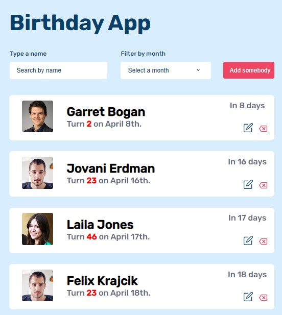

# Birthday app

## Overview



## Built With

-   [Javascript](https://javascript.com/)


## Features

In this project, I work with JavaScript to create a birthday app where you can see list of people's birthday. The data is from a local json file. I fetch them in my script file and display them with HTML and added styles to the page to make it looks good.

## How does it work

At the top of the content of the app, you can find an add items button where you can click and get a form for adding an item to the list. The two other fields are used for filtering the list. The first field is a search input where you can type somebody's name in the the list and the list will only show that sing person's birthday, the second field is a select field where you can filter the list by selecting one option and you will get list of people who have their birthday at the selected month.

In the real list, you can see a profile of the person, all the profile pictures are the same because the are just random images. Then you can see the person's names and their age, you can see the number of days which is the number of days until their next birthday. You can edit a person's description by clicking the edit button. This will give you a form for editing. You can also delete an item from the list by clicking the delete button.

## How To Use

<!-- Example: -->

To clone and run this application, you'll need [Git](https://git-scm.com) and [Node.js](https://nodejs.org/en/download/) (which comes with [npm](http://npmjs.com)) installed on your computer. From your command line:

```bash
# Fork this repository
$ https://github.com/Mickaellah/birthday-app.git

# Clone the forked repository
$ git clone https://github.com/[your-user-name]/birthday-app.git

# Install dependencies
$ npm install

# Run the app
$ npm start
```

## Contact

-   GitHub [@Mickaella](https://github.com/Mickaellah/birthday-app)
